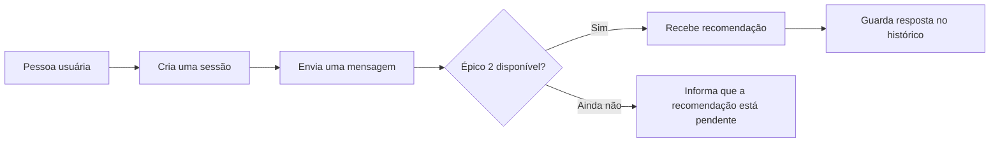

# KAN-8 — Backend da conversa

Este documento explica, de forma rápida, o que foi entregue no ticket KAN-8.
Ele ajuda tanto quem quer entender a entrega quanto quem vai ligar as próximas
partes do projeto.

## Resumo rápido

| Situação | O que significa |
| --- | --- |
| Pronto | O sistema cria e organiza cada conversa, guarda o histórico e controla o tempo de uso. |
| Pronto | As rotas para criar conversa, enviar mensagem e consultar histórico já existem. |
| Pendente | As recomendações de músicas dependem do Épico 2. |
| Seguro para integrar | Nenhuma música é inventada enquanto o Épico 2 não estiver ligado. |

## Como a conversa funciona



Uma **sessão** é a conversa de uma pessoa com o agente. Ela começa vazia e
recebe um identificador único. Após 30 minutos sem uso, a conversa é removida
automaticamente. Se o servidor for reiniciado, as conversas também recomeçam
vazias. Isso não altera futuros dados de login do Spotify.

## O que já pode ser usado

| Ação | Endereço | Resultado |
| --- | --- | --- |
| Criar uma conversa | `POST /session` | Devolve `session_id`, o identificador da conversa. |
| Enviar uma mensagem | `POST /chat` | Recebe `session_id` e `mensagem`. Quando o Épico 2 estiver ligado, devolve a resposta e as faixas recomendadas. |
| Consultar a conversa | `GET /chat/historico?session_id=...` | Devolve as mensagens já registradas. |
| Conferir se o servidor está disponível | `GET /health` | Mostra a situação do serviço de linguagem configurado. |

Exemplo para criar uma conversa:

```json
POST /session
{
  "session_id": "<uuid4>"
}
```

Depois, a pessoa usa esse mesmo `session_id` ao enviar uma mensagem:

```json
POST /chat
{
  "session_id": "<uuid4>",
  "mensagem": "Quero músicas calmas para estudar"
}
```

Quando a recomendação estiver pronta, a resposta seguirá estes nomes para
facilitar a ligação com a tela do projeto:

```json
{
  "session_id": "<uuid4>",
  "mensagem": "Resposta do agente",
  "faixas": [],
  "diversidade_generos": 0,
  "cobertura_sessao": 0.0,
  "consulta_efetiva": {}
}
```

Cada item do histórico informa quem enviou a mensagem (`usuario`, `agente` ou
`sistema`), o conteúdo, as faixas citadas e a data em horário UTC.

## Cuidados já incluídos

- Mensagens vazias não são aceitas.
- Uma sessão inexistente ou vencida devolve `sessao_invalida`.
- Se a recomendação não puder ser criada, nada incompleto é salvo no histórico.
- Enquanto o Épico 2 não estiver disponível, a rota de conversa devolve
  `pipeline_indisponivel` e não apresenta resultados fictícios.

## Próxima ligação: Épico 2

O KAN-8 já deixou preparado o ponto de ligação chamado `TurnProcessor`. O
Épico 2 deverá receber a mensagem da pessoa e o contexto da conversa — como
mensagens anteriores e faixas já mostradas — e devolver uma resposta com as
recomendações.

Quando essa parte estiver disponível, a ligação será feita sem mudar os nomes
das pastas nem refazer as rotas já usadas. Só depois de uma resposta completa
as duas mensagens, da pessoa e do agente, serão incluídas no histórico.

## Onde olhar no código

| Parte | Local |
| --- | --- |
| Inicialização do servidor | `agente_conversacional/app.py` |
| Rotas da conversa | `agente_conversacional/api/routes.py` |
| Organização das sessões | `agente_conversacional/sessions/store.py` |
| Ponto de ligação com o Épico 2 | `agente_conversacional/chat/contracts.py` |

## Como confirmar a entrega

Os testes do agente verificam criação, consulta e vencimento de sessões;
mensagens inválidas; histórico; respostas de erro; a futura ligação com o
Épico 2; e se o comando documentado `uvicorn app:app --reload` consegue
carregar o servidor. Para executá-los, use `pytest` dentro de
`agente_conversacional`.
