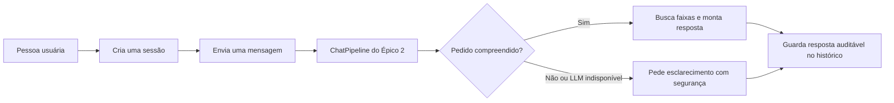

# KAN-8 — Backend da conversa

Este documento explica, de forma rápida, o que foi entregue no ticket KAN-8.
Ele ajuda tanto quem quer entender a entrega quanto quem vai ligar as próximas
partes do projeto.

## Resumo rápido

| Situação | O que significa |
| --- | --- |
| Pronto | O sistema cria e organiza cada conversa, guarda o histórico e controla o tempo de uso. |
| Pronto | As rotas para criar conversa, enviar mensagem e consultar histórico já existem. |
| Integrado | `POST /chat` usa o `ChatPipeline` real do Épico 2 por padrão. |
| Seguro | As faixas vêm da busca determinística; falhas de interpretação ou de LLM viram mensagens claras, sem resultados inventados. |

## Como a conversa funciona



Uma **sessão** é a conversa de uma pessoa com o agente. Ela começa vazia e
recebe um identificador único. Após 30 minutos sem uso, a conversa é removida
automaticamente. Se o servidor for reiniciado, as conversas também recomeçam
vazias. Isso não altera futuros dados de login do Spotify.

## O que já pode ser usado

| Ação | Endereço | Resultado |
| --- | --- | --- |
| Criar uma conversa | `POST /session` | Devolve `session_id`, o identificador da conversa. |
| Enviar uma mensagem | `POST /chat` | Recebe `session_id` e `mensagem`, executa o pipeline e devolve texto, faixas e métricas. |
| Consultar a conversa | `GET /chat/historico?session_id=...` | Devolve as mensagens já registradas. |
| Conferir se o servidor está disponível | `GET /health` | Mostra a situação do serviço de linguagem configurado. |

Exemplo para criar uma conversa:

```json
POST /session
{
  "session_id": "<uuid4>"
}
```

Depois, a pessoa usa esse mesmo `session_id` ao enviar uma mensagem:

```json
POST /chat
{
  "session_id": "<uuid4>",
  "mensagem": "Quero músicas calmas para estudar"
}
```

Uma resposta de recomendação segue estes nomes para facilitar a ligação com a
tela do projeto:

```json
{
  "session_id": "<uuid4>",
  "mensagem": "Resposta do agente",
  "faixas": [],
  "diversidade_generos": 0,
  "cobertura_sessao": 0.0,
  "consulta_efetiva": {}
}
```

Cada item do histórico informa quem enviou a mensagem (`usuario`, `agente` ou
`sistema`), o conteúdo, as faixas citadas e a data em horário UTC.

## Cuidados já incluídos

- Mensagens vazias não são aceitas.
- Uma sessão inexistente ou vencida devolve `sessao_invalida`.
- Se a recomendação não puder ser criada, nada incompleto é salvo no histórico.
- Se o roteador e a extração não conseguirem interpretar o pedido, o sistema
  pede esclarecimento sem consultar uma recomendação vazia.
- Se a geração pelo LLM falhar, a resposta usa um template determinístico com
  as faixas já encontradas; IDs citados fora do resultado são removidos e
  registrados em log de auditoria.

## Integração concluída com o Épico 2

O ponto de ligação `TurnProcessor` agora é implementado por
`chat.pipeline.ChatPipeline` no boot normal da aplicação. Ele recebe a
mensagem e o contexto da sessão — histórico, perfil e faixas já mostradas —,
passa pelo roteador, extração/validação quando necessário, busca, geração e
auditoria antes de devolver a resposta.

Somente depois de um turno completo as mensagens da pessoa e do agente são
incluídas no histórico. A tela cria a sessão no backend antes do primeiro
envio e preserva o mesmo `session_id` em recargas; não apresenta um catálogo
local como se fosse uma resposta confirmada quando o servidor estiver fora.

## Onde olhar no código

| Parte | Local |
| --- | --- |
| Inicialização do servidor | `agente_conversacional/app.py` |
| Rotas da conversa | `agente_conversacional/api/routes.py` |
| Organização das sessões | `agente_conversacional/sessions/store.py` |
| Contrato da ligação | `agente_conversacional/chat/contracts.py` |
| Implementação do pipeline | `agente_conversacional/chat/pipeline.py` |

## Como confirmar a entrega

Os testes do agente verificam criação, consulta e vencimento de sessões;
mensagens inválidas; histórico; respostas de erro; o turno completo do
Épico 2 pela API; fallback seguro; auditoria de citações; e se o comando
documentado `uvicorn app:app --reload` consegue carregar o servidor. Para
executá-los, use `python -m pytest` dentro de `agente_conversacional`.
